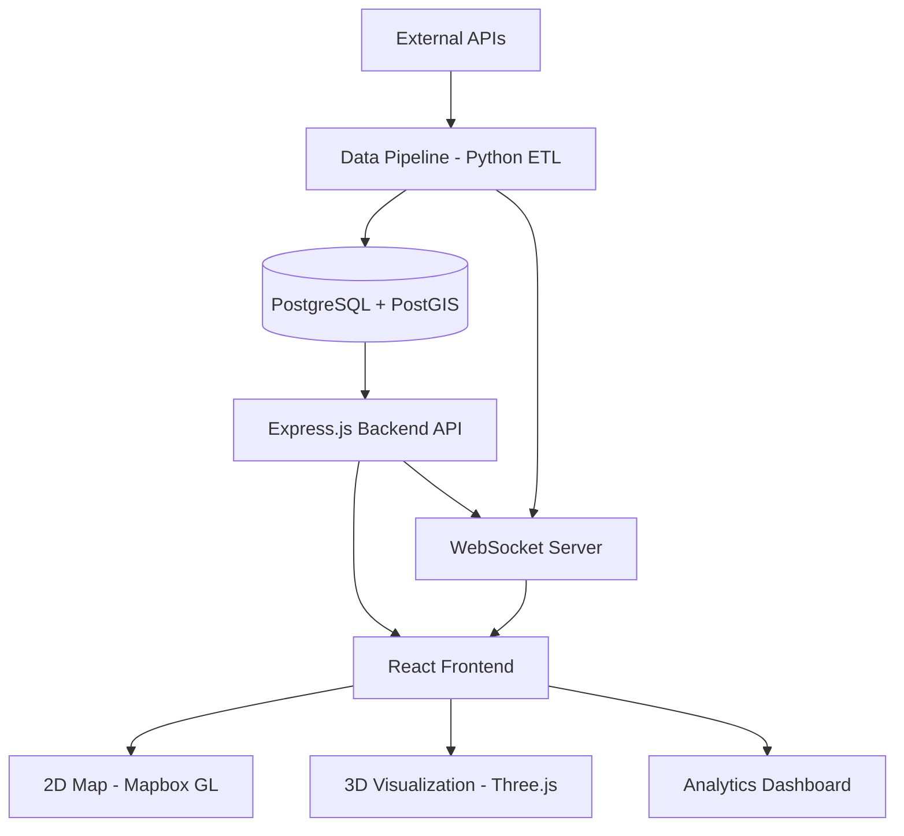

# 🌍 Disaster Impact Visualizer

Real-time North American disaster monitoring and impact assessment system with 3D visualization, PostGIS spatial analysis, and comprehensive emergency response insights.


## 🎯 Project Overview

This capstone project demonstrates advanced GIS capabilities, full-stack development, and real-time data processing through an interactive disaster impact analysis platform. The system integrates multiple disaster data sources across North America, performs sophisticated spatial analysis using PostGIS, and provides compelling 3D visualizations with Three.js.

### Key Features

- **Multi-Source Data Integration**: Aggregates real-time disaster data from NASA FIRMS, USGS, NOAA, and Canadian government APIs
- **Advanced Spatial Analysis**: PostGIS-powered calculations for affected populations, infrastructure impact, and evacuation zones
- **3D Terrain Visualization**: Interactive Three.js scenes with elevation data, disaster progression animations, and population density heat maps
- **Real-Time Updates**: WebSocket-based live disaster tracking with sub-minute latency
- **Impact Assessment**: Automated calculation of affected populations, vulnerable groups, and critical infrastructure
- **Historical Analysis**: Disaster clustering, hotspot identification, and trend analysis

## 🏗️ Architecture



## 🛠️ Tech Stack

### Backend
- **Node.js** + **Express.js**: RESTful API server
- **PostgreSQL** + **PostGIS**: Spatial database with GIS extensions
- **WebSocket**: Real-time disaster updates
- **Redis**: Caching layer for performance

### Frontend
- **React 18**: Component-based UI
- **Three.js** + **React Three Fiber**: 3D visualizations
- **Mapbox GL JS**: 2D interactive mapping
- **Recharts**: Analytics and charts
- **Zustand**: State management

### Data Pipeline
- **Python**: ETL processes
- **Pandas** + **GeoPandas**: Data transformation
- **APScheduler**: Automated data fetching

### DevOps
- **Docker** + **Docker Compose**: Containerization
- **GitHub Actions**: CI/CD pipeline

## 🚀 Quick Start

### Prerequisites

- Docker & Docker Compose
- Node.js 18+ (for local development)
- Python 3.10+ (for data pipeline)
- Git

### Installation

1. **Clone the repository**
```bash
git clone https://github.com/TinyCabinCreative/GIS-Disaster-Impact-Visualizer.git
cd disaster-impact-visualizer
```

2. **Set up environment variables**
```bash
cp .env.example .env
# Edit .env with your API keys
```

3. **Start with Docker**
```bash
docker-compose up -d
```

This will start:
- PostgreSQL with PostGIS on port 5432
- Backend API on port 5000
- Frontend on port 3000
- Data pipeline ETL service
- Redis on port 6379

4. **Initialize the database**
```bash
npm run db:migrate
npm run db:seed
```

5. **Access the application**
- Frontend: http://localhost:3000
- API: http://localhost:5000/api
- API Health: http://localhost:5000/health

## 📊 Data Sources

### United States
- **NASA FIRMS**: Active wildfire data
- **USGS**: Earthquake monitoring
- **NOAA**: Flood and severe weather alerts

### Canada
- **Canadian Wildland Fire Information System (CWFIS)**: Wildfire data
- **Natural Resources Canada**: Seismic activity
- **Environment Canada**: Weather alerts and air quality

## 🗂️ Project Structure

```
disaster-impact-visualizer/
├── backend/              # Express.js API
├── frontend/             # React application
├── data-pipeline/        # Python ETL services
├── database/             # SQL migrations and schemas
├── docker/               # Dockerfiles
├── docs/                 # Documentation & diagrams
└── tests/                # E2E tests
```

## 🔑 Key Components

### Spatial Analysis Engine
Located in `backend/src/services/spatialAnalysis.js`, this service handles:
- Population impact calculations using spatial intersections
- Infrastructure proximity analysis
- Evacuation zone buffer generation
- Disaster clustering and hotspot detection

### 3D Visualization
Located in `frontend/src/components/ThreeJS/`, featuring:
- Real-time terrain rendering with elevation data
- Animated disaster progression
- Population density height maps
- Interactive camera controls

### Data Pipeline
Located in `data-pipeline/etl/ingestors/`, with dedicated modules for:
- NASA FIRMS wildfire data ingestion
- USGS earthquake feed processing
- NOAA flood alert parsing
- Canadian data source integration

## 📈 Database Schema

The PostGIS database includes:

- **disasters**: Spatial geometries of disaster events
- **infrastructure**: Critical facilities (hospitals, shelters, etc.)
- **census_blocks**: Population and demographic data
- **impact_assessments**: Computed impact analysis
- **alerts**: Real-time emergency notifications

See `database/migrations/001_initial_schema.sql` for complete schema.

## 🧪 Testing

```bash
# Run all tests
npm test

# Backend tests
npm run test:backend

# Frontend tests
npm run test:frontend

# E2E tests
npm run test:e2e
```

## 📚 API Documentation

### Key Endpoints

#### Disasters
- `GET /api/disasters` - List disasters with spatial filtering
- `GET /api/disasters/:id` - Get disaster details
- `GET /api/disasters/:id/impact` - Get impact assessment

#### Infrastructure
- `GET /api/infrastructure` - List infrastructure
- `GET /api/infrastructure/nearest` - Find nearest facilities

#### Impact Analysis
- `GET /api/impact/population/:disasterId` - Affected population
- `GET /api/impact/evacuation-zones/:disasterId` - Evacuation zones

Full API documentation: [docs/api/api-documentation.md](docs/api/api-documentation.md)

## 🎨 Screenshots

[Add screenshots here when available]

## 🚧 Development Roadmap

- [x] Core database schema with PostGIS
- [x] Backend API with spatial queries
- [ ] USGS earthquake data integration
- [ ] NASA FIRMS wildfire integration
- [ ] 2D Mapbox visualization
- [ ] 3D Three.js terrain rendering
- [ ] Real-time WebSocket updates
- [ ] Historical data analysis
- [ ] Canadian data source integration
- [ ] Impact assessment automation

## 🤝 Contributing

This is a personal project, but suggestions and feedback are welcome! Please open an issue to discuss proposed changes.

## 📄 License

This project is licensed under the MIT License - see the [LICENSE](LICENSE) file for details.

## 👤 Author

**Your Name**
- GitHub: [@yourusername](https://github.com/yourusername)
- LinkedIn: [Your Profile](https://linkedin.com/in/yourprofile)
- Email: your.email@example.com

## 🙏 Acknowledgments

- NASA FIRMS for wildfire data
- USGS for earthquake monitoring
- Natural Resources Canada for Canadian disaster data
- PostGIS community for spatial database tools
- Three.js community for 3D visualization resources

---

**Note**: This project is for educational and demonstration purposes. Always refer to official emergency services and government agencies for real disaster information.